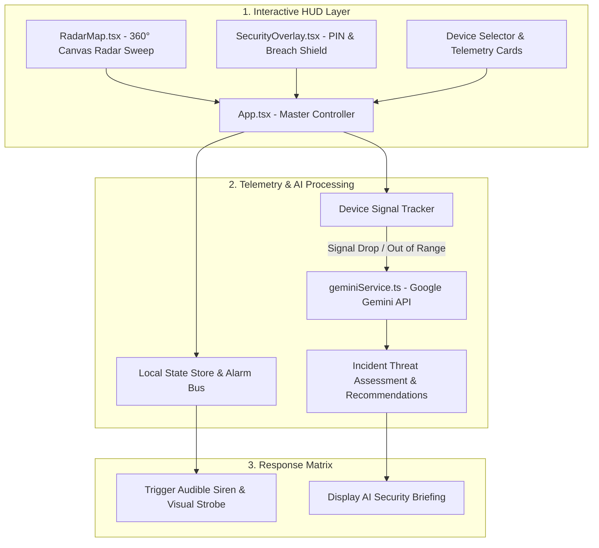

<div align="center">


# 🛰️ HEADSETTER (RADAR HUD & SECURITY MATRIX)
### Next-Gen Audio Peripheral Radar Tracking, Proximity Shields & AI Security Assistant

[](https://reactjs.org/)
[](https://www.typescriptlang.org/)
[](https://vitejs.dev/)
[](https://ai.studio/apps/drive/1pI8ZnuHllgANDenn-cYBm0g28iF93tqj)
[](https://opensource.org/licenses/MIT)

<p align="center">
  <b>Headsetter Radar HUD</b> is a futuristic cyber-defense interface prototype for monitoring headphones, speakers, and mobile accessories. Built with <b>React</b>, <b>TypeScript</b>, and <b>Google Gemini AI</b>, this app visualizes active devices on an animated circular radar screen, enforces digital perimeter barriers, and leverages LLM intelligence for risk assessments.
</p>

[🤖 Google AI Studio Prototype](https://ai.studio/apps/drive/1pI8ZnuHllgANDenn-cYBm0g28iF93tqj) • [✨ Key Features](#-key-features) • [🏛️ Radar Architecture](#-radar-tracking-architecture) • [🚀 Quickstart](#-quickstart-guide) • [🔑 Environment](#-environment-configuration) • [📁 Structure](#-project-structure)

</div>

---

## 🌟 Key Features

* **📡 Circular 360° Radar Map**: Dynamic canvas sweep radar (`RadarMap.tsx`) visualizing peripheral proximity, signal attenuation, and bearing.
* **🛡️ Interactive Security Shield**: Multi-layer security overlay (`SecurityOverlay.tsx`) presenting live system health, PIN arming triggers, and intrusion warnings.
* **🧠 Gemini AI Incident Intelligence**: Leverages `@google/genai` to analyze connection loss events, classify threat levels, and suggest preventative device placement.
* **🚨 Rapid Intrusion Feedback**: High-contrast flashing alerts and audible alarms when paired accessories drop connection unexpectedly.
* **⚡ High-Performance React + Vite Shell**: Instant hot-reload, zero-latency component state synchronization, and modern TypeScript contracts (`types.ts`).

---

## 🏛️ Radar Tracking Architecture



---

## 🛠️ Tech Stack

| Layer | Technologies |
| :--- | :--- |
| **Frontend Framework** | React 18 with TypeScript |
| **Build & Tooling** | Vite (Ultra-fast bundler) |
| **Generative AI** | Google Gemini API (`@google/genai`) |
| **Visualization** | HTML5 Canvas 2D Radar Renderer + Tailwind CSS |
| **Platform** | Google AI Studio App Export |

---

## 🚀 Quickstart Guide

### Prerequisites
* **Node.js 18.x or higher**
* A valid **Google Gemini API Key** (available free from [Google AI Studio](https://aistudio.google.com/))

### 1. Clone the Repository
```bash
git clone https://github.com/harinarayana1457-cmyk/Head_setter_UI_version.git
cd Head_setter_UI_version
```

### 2. Install Dependencies
```bash
npm install
```

### 3. Configure API Credentials
Create a `.env.local` file in the project root:
```env
GEMINI_API_KEY=your_google_gemini_api_key_here
```

### 4. Start Development Server
```bash
npm run dev
```
Open `http://localhost:5173` in your browser.

### 5. Build for Production
```bash
npm run build
```

---

## 📁 Project Structure

```text
Head_setter_UI_version/
├── components/
│   ├── RadarMap.tsx          # 360-degree radar sweep canvas renderer
│   └── SecurityOverlay.tsx   # Glassmorphic security shield & PIN verification UI
├── services/
│   └── geminiService.ts      # Google Gemini AI assistant & incident analyzer
├── App.tsx                   # Main HUD container & telemetry dispatcher
├── index.html                # Application mount shell
├── index.tsx                 # React DOM bootstrapping
├── types.ts                  # Device, signal, and security status data schemas
├── package.json              # Dependencies and script definitions
├── vite.config.ts            # Vite configuration
├── metadata.json             # AI Studio app metadata
├── .gitignore                # Production ignore rules
└── README.md                 # Project documentation
```

---

## 📄 License & Credits

* Developed by **[Hari Narayana (@harinarayana1457-cmyk)](https://github.com/harinarayana1457-cmyk)**.
* Prototyped using **Google AI Studio**.
* Distributed under the **MIT License**.
